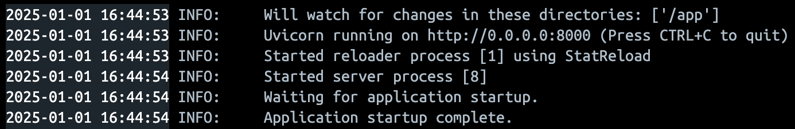
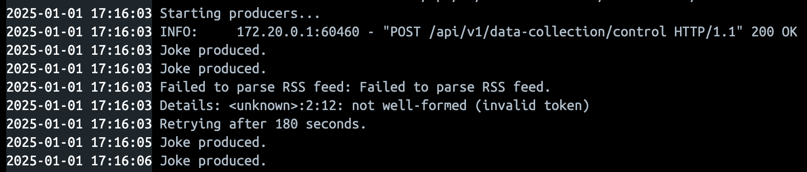
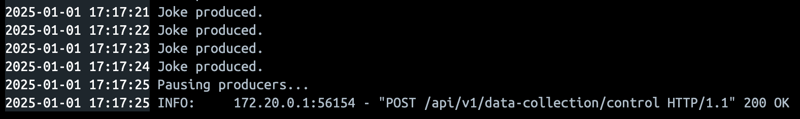
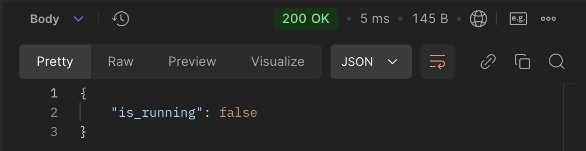

# Data Collection App

This application collects data from various sources and produces messages to Kafka topics. It includes producers for daily trivia and jokes.

## Features

- **Daily Trivia Producer**: Fetches random articles from the Reddit Today I Learned RSS feed and sends them to a Kafka topic.
- **Jokes Producer**: Fetches jokes from an API and sends them to a Kafka topic.
- **Graceful Shutdown**: Handles signals to stop the producers gracefully.

## Requirements

- Python 3.13
- Kafka
- Docker (for containerization)

**Note**: In order to run this service, Kafka needs to be turned on. The manual on how to do this is placed inside the `infrastructure` directory in the [README.md](../infrastructure/README.md).


## Installation

1. **Clone the repository**:
    ```bash
    git clone https://github.com/CzumperBirds/CzumperSearch.git
    cd data_collection
    ```

2. **Install dependencies**:
    ```sh
    make install
    ```

3. **Run tests**:
    ```sh
    make test
    ```

## Running with Docker

1. **Build and run the Docker image**:
    ```sh
    make build
    ```

    

    This should appear in the Docker console. The service is ready for user commands.

## Managing the process of message factory

1. **Start/restard the message producing**:
    ```sh
    make start
    ```
    Example behaviour:
    

2. **Stop the message producing**:
    ```sh
    make stop
    ```
    Example behaviour:
    

3. **Check the status of the service**
    ```sh
    make status
    ```
    Example answer:
    